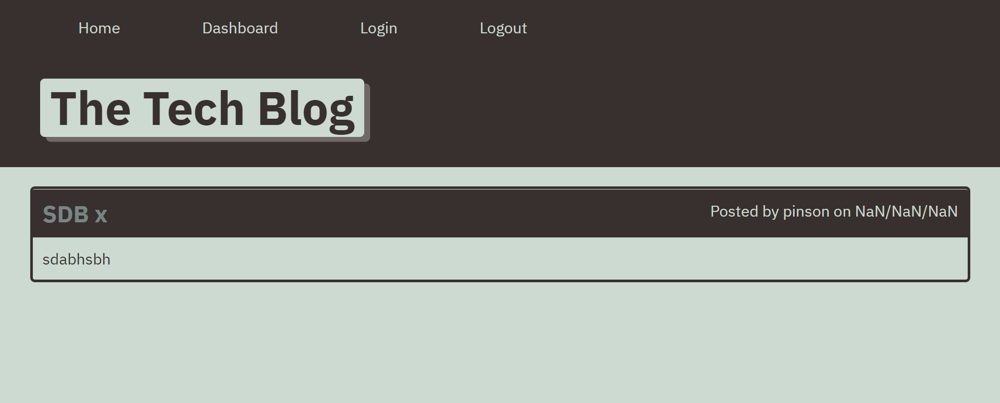

# tech-blog

## Goal:
Create a blog for tech nerd where they can share their ideas and comments other people posts.

## how it works:

1. On the hompage of the webside your a shown a nav bar and all posred blogs.
from the nav bar bar you can sign in or loggin.
2. Upon logging you can write your own blogs and comments other people blogs.
3. when logged in you can update or delete any of your post.
4. When finished  you can log out of your account.
5. When logging back all your previusly saved post will apear again.

##Screenshots:

##Links:

GitHub Ripo:
https://github.com/zpinson/tech-blog
Deployed link:
https://zptheckblog.herokuapp.com